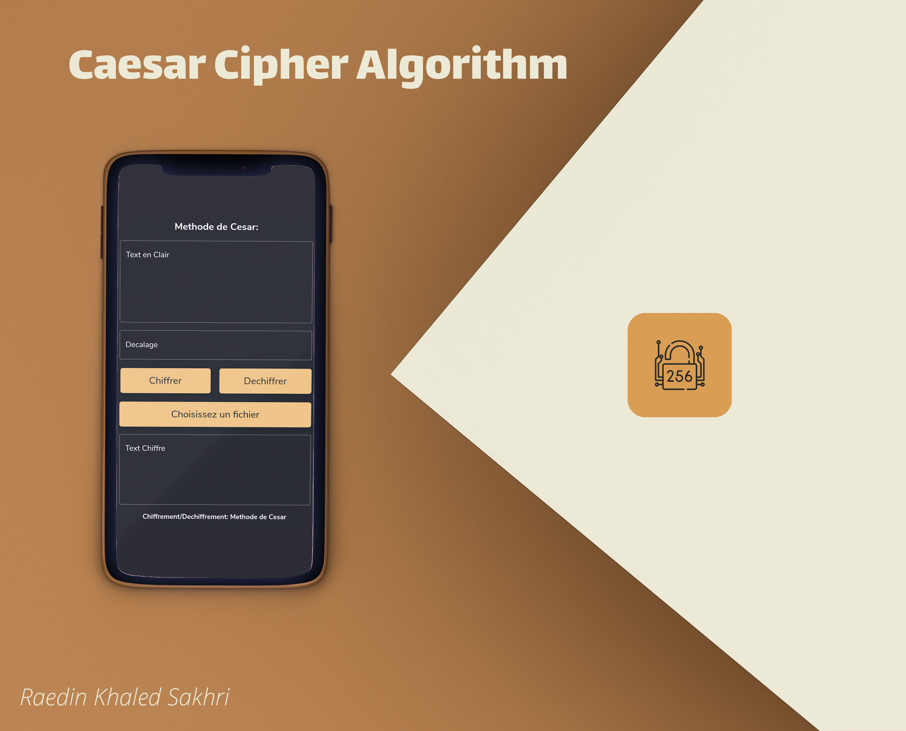

# TP 01 : Raedin Khaled Sakhri / Groupe: 2

You can check my code at lib/main.dart : Encrypt Function starts from Line 34 and Decrypt Function Starts from Line 61.
There are two possibilites to input text : 1- by typing directly to the Text Field, or by uploading a .txt file from your phone.
I have uploaded .apk FILE ready to be Installed on your Device, so you can test the app directly on Your Phone.
Download the apk from here: https://github.com/raedinkhaled/cipher/raw/master/cipher.apk
You may get some Security Warnings about the app due to Google Play Protect policy.
If you want, I can upload the app to the Play Store and give you the link from there so you don't get those Security Warnings.

# Caesar Cipher

Caesar Cipher Algorithm App.

## Getting Started

> ⚠️ This project was created by: Raedin Khaled Sakhri.

## Pre-requisites

Make sure you have Flutter dev tools installed.
You can test that by running the following command in a terminal:

```bash
flutter doctor -v
```

This will check that everything is alright.

If you don't have the flutter dev tools yet, please visit the [official Flutter page](https://flutter.dev).

## Setup the project

1. Clone the project

```bash
git clone https://github.com/raedinkhaled/cipher.git
```
2. all the code is located in lib/main.dart

* Run the app using Android Studio, VSCode or the Command line interface

```bash
flutter run lib/main.dart
```

## Dependencies

This project depends on two Flutter/Dart Packages:

 * string_validator
 * file_picker
 
 Check pubspec.yaml File.
 
 # Start Developing
 
 Enjoy Fluttering and if you have any question, please contact me!
